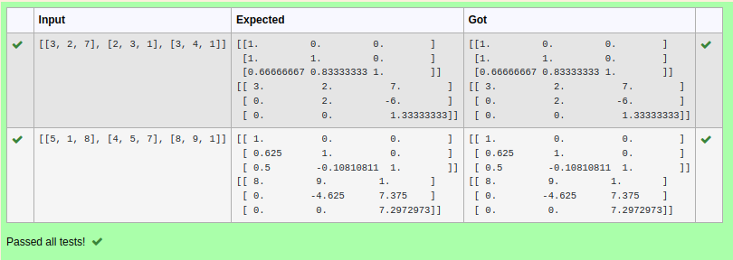
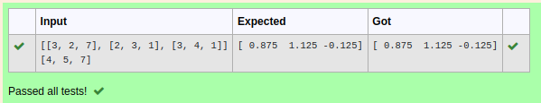

# LU Decomposition 

## AIM:
To write a program to find the LU Decomposition of a matrix.

## Equipments Required:
1. Hardware – PCs
2. Anaconda – Python 3.7 Installation / Moodle-Code Runner

## Algorithm:
1.Import numpy library using import statement.

2.From scipy package import lu().

3.Get input from user and pass it as an array.

4.Get P, L, U matrix using lu().

5.Print L and U matrix.

## Program:

```python
Program to find L and U matrix using LU decomposition.
Developed by: Harini V
RegisterNumber: 22004214
(i) To find the L and U matrix
import numpy as np
from scipy.linalg import lu
a=eval(input())
P,L,U=lu(a)
print(L)
print(U)
```

```python
Program to find the L and U matrix.
Developed by: Harini V
RegisterNumber: 22004214
(ii) To find the LU Decomposition of a matrix
import numpy as np
from scipy.linalg import lu_factor,lu_solve
a=eval(input())
b=eval(input())
lu, piv=lu_factor(a)
x=lu_solve((lu, piv),b)
print(x)
```

## Output:




## Result:
Thus the program to find the LU Decomposition of a matrix is written and verified using python programming.

